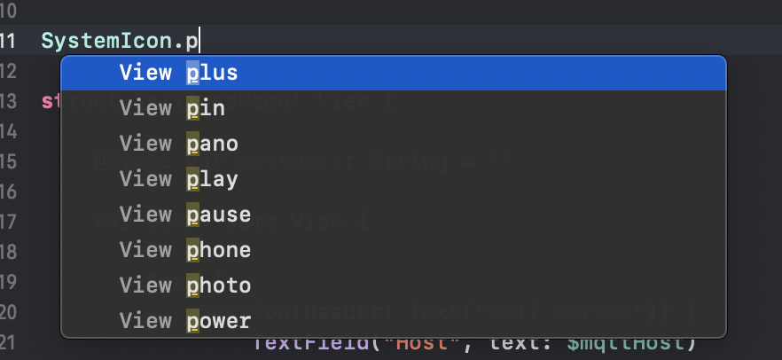

# SystemIcons

SwiftUI allows the loading of SF Symbols, a set of modern, configurable symbols
designed by Apple to integrate with their San Fransisco font.

This project generates a swift file containing a single struct, `SystemIcon`, that
provides a static property for each of the 1500+ icons in the collection,
allowing them to be accessed easily via Xcode autocomplete.



The project is generated from the symbols JSON file (provided under MIT license) found in the [SFSymbols.com](https://github.com/noahsark769/sfsymbols.com) repo.

## Usage

To use the latest file, simply import the `SystemIcon.swift` file in the root of this repo.

```shell
cp SystemIcon ../MySwiftProject/Sources/MyLibrary/
```
To build the project and generate the file yourself, run:

```shell
swift build && .build/debug/SystemIcons
```
